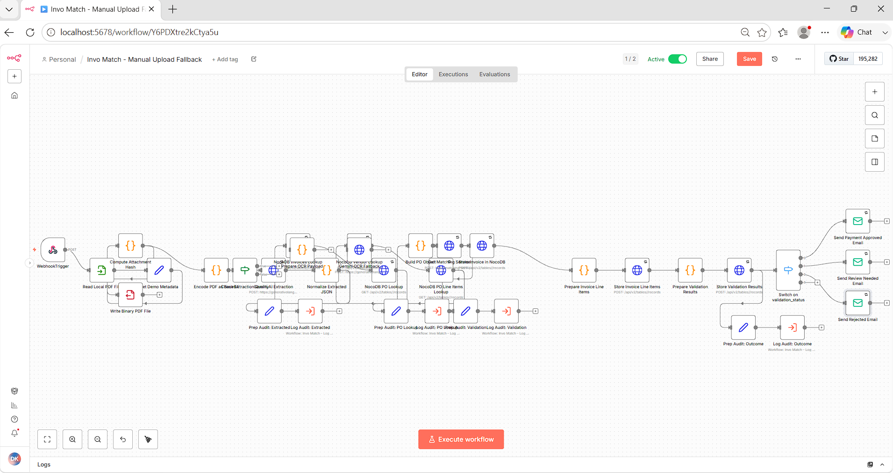
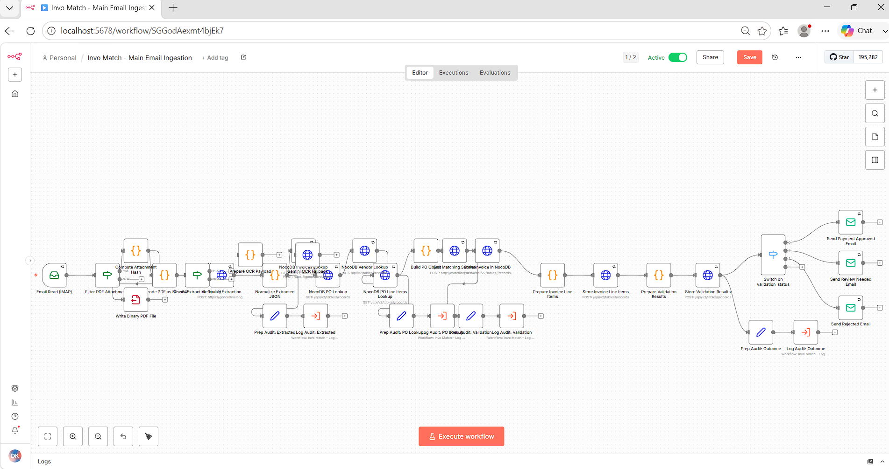
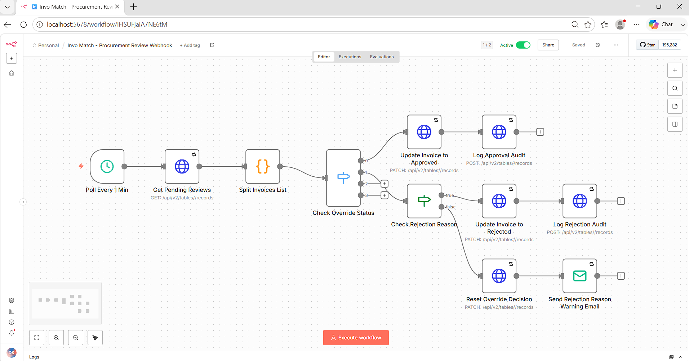
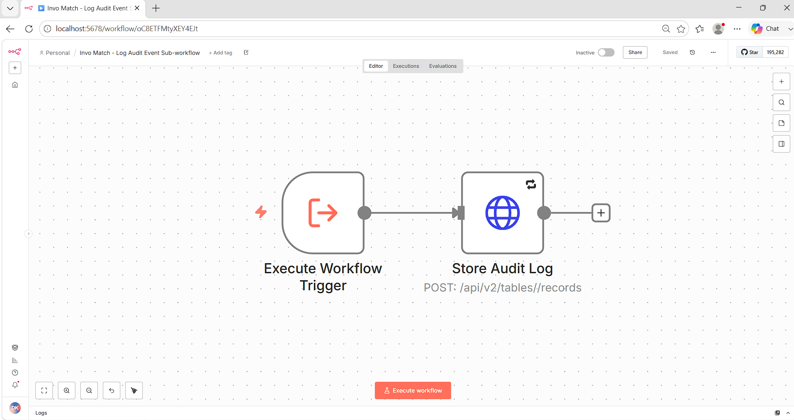
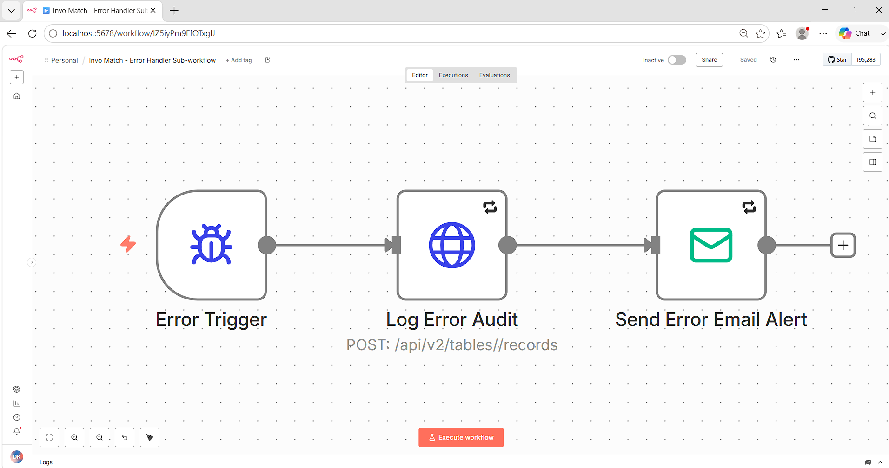
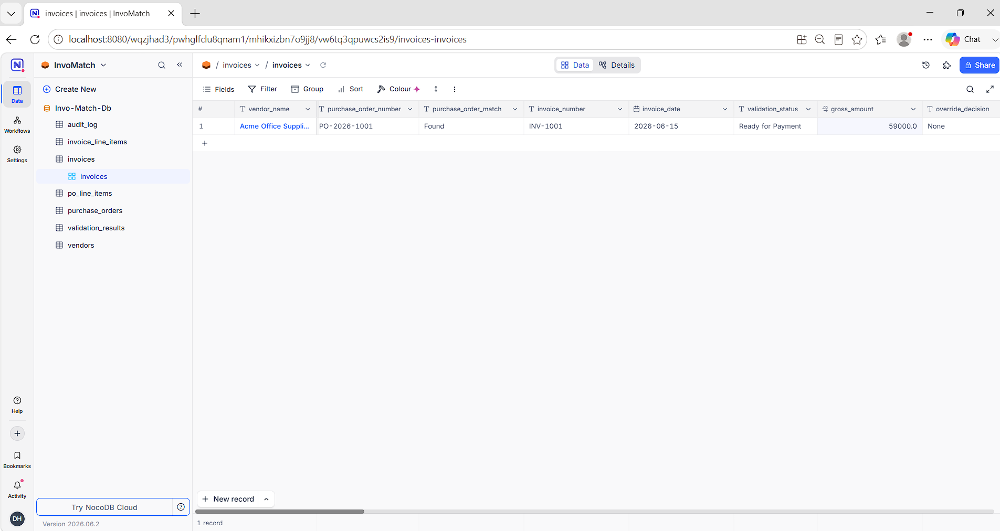
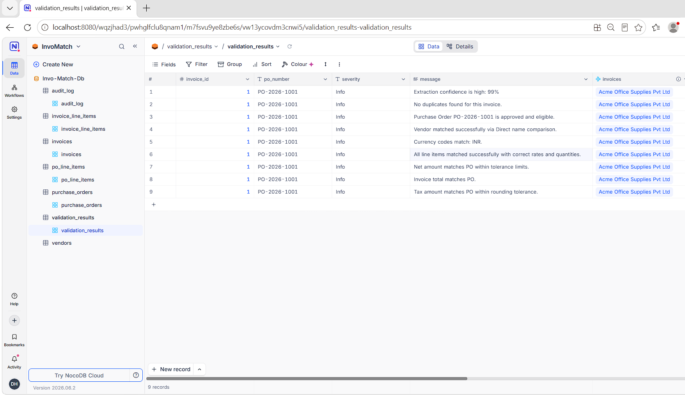
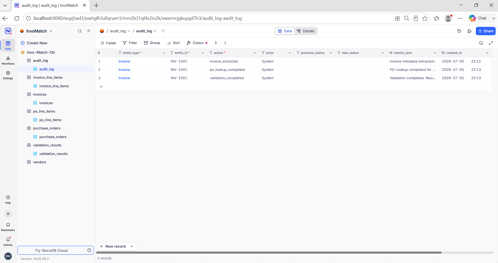

# 🧾 InvoMatch — AI-Powered Invoice Matching & Validation System

**InvoMatch** is a production-grade **Accounts Payable automation platform** built entirely on a self-hosted, free-tier stack. It ingests vendor invoices via email or manual upload, extracts structured data using **Google Gemini AI**, matches them against Purchase Orders (POs) in **NocoDB**, enforces 12+ business validation rules through a **Node.js matching engine**, and routes outcomes to one of three states: ✅ Ready for Payment | 🔍 Procurement Review | ❌ Rejected — complete with email notifications and a full audit trail.

<p align="center">
  
  
  
  
  
  
</p>

---

## 📚 Table of Contents

- [🚀 Features](#-features)
- [🏗️ System Architecture & Diagram](#️-system-architecture--diagram)
- [⚙️ How It Works (Pipeline)](#️-how-it-works-pipeline)
- [🛠️ Technical Decisions & Design Choices](#️-technical-decisions--design-choices)
- [📸 Demo Screenshots](#-demo-screenshots)
- [🎥 Demo Video](#-demo-video)
- [🔬 Validation Rules & Test Coverage](#-validation-rules--test-coverage)
- [⚙️ Setup Instructions & Running the App](#️-setup-instructions--running-the-app)
  - [Prerequisites](#prerequisites)
  - [Installation](#installation)
  - [Configure Environment](#configure-environment)
  - [Running the Application](#running-the-application)
- [📁 Project Structure](#-project-structure)
- [🔒 Workflow API Reference](#-workflow-api-reference)
- [⚠️ Known Limitations](#️-known-limitations)
- [🔮 Future Improvements](#-future-improvements)
- [📬 Contact](#-contact)

---

## 🚀 Features

### 📥 Dual Invoice Ingestion Channels
- **Email (IMAP):** Polls Gmail every minute, detects PDF attachments, hashes files to prevent re-processing, and feeds the full pipeline automatically.
- **Manual Upload (Webhook):** Accepts `POST /webhook/invo-match-upload` with a filename; reads from a mounted sample invoices directory for demo and batch testing.

### 🤖 AI-Powered PDF Data Extraction (Gemini 2.5 Flash)
- Converts invoices directly to base64 and submits them to **Google Gemini 2.5 Flash** as inline multimodal data — no intermediate file parsing needed.
- Extracts: vendor name, vendor ID, PO number, invoice number, dates, currency, net/tax/gross amounts, and line items (SKU, quantity, unit price, tax rate).
- **OCR & Quality Detection:** The pipeline sends base64 PDF data directly to Gemini, which natively performs OCR on scanned documents. The extraction prompt instructs Gemini to automatically detect if a document is a scanned image, photocopy, or low-quality, flag `ocr_used` as `true`, and cap its confidence score at `0.75` to automatically route it to procurement review.

### 🔗 Intelligent PO Matching Engine (Node.js/Docker)
- A dedicated Express microservice (`http://matching-service:4000/match`) applies 12+ configurable business rules in sequence.
- Matches vendor names with **alias-aware fuzzy normalization** (strips legal suffixes, normalises whitespace, checks alias arrays).
- Performs line-item-level comparison including SKU, quantity, unit price, and tax rate — not just header-level totals.
- Supports **configurable tolerance** (percentage and absolute amount) per PO.

### 🔍 Duplicate Detection
- SHA-256 hashes every PDF attachment on arrival.
- Cross-checks the hash against the invoices table before extraction to catch exact duplicate files.
- Also detects **semantic duplicates** by comparing invoice numbers against existing records.

### 📊 Full Audit Trail
- Every significant pipeline event (extraction, PO lookup, validation, outcome) is logged to the `audit_log` NocoDB table via the **Log Audit Event sub-workflow**.
- Captures: entity type, entity ID, action, actor, previous status, new status, timestamps, and structured JSON details.

### 🔄 Procurement Review Override Loop
- Invoices routed to `Procurement Review` can be manually overridden in NocoDB by setting `override_decision` to `Approved` or `Rejected`.
- A dedicated scheduler polls every minute, detects changes, validates rejection reason presence, updates status, and logs the override audit event.
- Rejection without a reason is automatically reversed and a warning email is sent to the reviewer.

### 📧 Email Notifications
- Three outcome emails: **Payment Approved**, **Review Needed**, and **Rejected** — routed via Gmail SMTP with configurable sender/recipient addresses.
- **SMTP credentials** are auto-provisioned from `.env` and wired into all workflow nodes via `wire-workflows.js`.

---

## 🏗️ System Architecture & Diagram

```text
┌──────────────────────────────────────────────────────────────────────┐
│                    Invoice Input Channels                            │
│          Gmail IMAP (Email)  ·  Webhook POST (Manual Upload)         │
└─────────────────────────┬────────────────────────────────────────────┘
                          │ PDF Binary
┌─────────────────────────▼────────────────────────────────────────────┐
│                     n8n Workflow Orchestrator                        │
│  Compute Hash · Write PDF · Encode Base64 · AI Extraction            │
│  Normalize JSON · PO Lookup · Vendor Lookup · Build PO Object        │
└──────────┬───────────────────────────────────────────────────────────┘
           │ REST /match
┌──────────▼──────────────────┐        ┌──────────────────────────────┐
│  Node.js Matching Engine    │        │   Google Gemini 2.5 Flash    │
│  (Docker · Port 4000)       │        │   (Multimodal PDF Extract)   │
│  12+ Business Rule Checks   │        │   + OCR Fallback Prompt      │
└──────────┬──────────────────┘        └──────────────────────────────┘
           │ Validation Results
┌──────────▼──────────────────────────────────────────────────────────┐
│                     NocoDB + PostgreSQL                             │
│  invoices · invoice_line_items · validation_results                 │
│  purchase_orders · po_line_items · vendors · audit_log              │
└─────────────────────────────────────────────────────────────────────┘
           │
┌──────────▼──────────────────────────────────────────────────────────┐
│                       Routing & Notifications                       │
│     Ready for Payment → Accounting Email                            │
│     Procurement Review → Reviewer Email + Override Polling          │
│     Rejected → Rejection Email with Reasons                         │
└─────────────────────────────────────────────────────────────────────┘
```

---

## ⚙️ How It Works (Pipeline)

```text
┌──────────────────────┐       ┌─────────────────────────────┐
│  Email / Webhook     ├──────►│  Compute SHA-256 Hash       │
│  Invoice Trigger     │       │  Write PDF to /data/        │
└──────────────────────┘       └──────────────┬──────────────┘
                                              │
┌─────────────────────────────┐  ┌────────────▼──────────────┐
│  Normalize & Validate JSON  │◄─┤  Gemini AI Extraction     │
│  (vendor, PO, amounts, etc) │  │  (base64 inline_data)     │
└──────────────┬──────────────┘  └───────────────────────────┘
               │
┌──────────────▼──────────────┐       ┌─────────────────────┐
│  NocoDB Lookups             ├──────►│  Build PO Object    │
│  (PO · Vendor · Invoices)   │       │  (with line items)  │
└─────────────────────────────┘       └──────────┬──────────┘
                                                 │ REST POST
                                      ┌──────────▼──────────┐
                                      │  Matching Engine    │
                                      │  /match (port 4000) │
                                      └──────────┬──────────┘
                                                 │ Validation
┌─────────────────────────────────────────────────▼──────────────────┐
│  Store Invoice · Store Line Items · Store Validation Results       │
└──────────────────────────────────┬─────────────────────────────────┘
                                   │
               ┌───────────────────┼──────────────────────┐
               ▼                   ▼                      ▼
    ✅ Ready for Payment   🔍 Procurement Review    ❌ Rejected
    → Email Accounting     → Email Reviewer          → Email with Reasons
                           → Poll for Override
```

1. **Invoice Arrival:** Email IMAP or webhook receives the PDF. A SHA-256 hash is computed and the file is written to the invoices volume.
2. **AI Extraction:** The PDF is base64-encoded and sent to Gemini 2.5 Flash, which natively reads vector or scanned PDF data and dynamically flags if OCR was required.
3. **Normalization:** Extracted JSON is normalized (dates, currencies, amounts, vendor names) to a canonical schema.
4. **PO & Vendor Lookup:** The PO number is used to query NocoDB for the matching PO, its line items, the associated vendor (with aliases), and existing invoices (for duplicate detection).
5. **Matching Engine:** The Node.js microservice validates 12+ rules including amounts, currencies, vendors, line items, duplicates, and PO approval status.
6. **Persistence:** Invoice record, line items, and validation results are stored in NocoDB/PostgreSQL.
7. **Routing & Notifications:** Based on validation status, the correct email is sent and audit events are logged.

---

## 🛠️ Technical Decisions & Design Choices

### 1. AI Extraction — Google Gemini 2.5 Flash
- **Choice:** Submit PDFs as `inline_data` (base64) in the multimodal Gemini API call.
- **Reasoning:** Eliminates the need for a separate PDF-to-text conversion step. Gemini's vision capability handles both text-based and image-based PDFs natively, making the pipeline simpler and more robust against varied invoice formats.
- **OCR & Quality Detection:** Gemini is instructed to evaluate the visual clarity of the document. For scanned/low-resolution documents, it sets `ocr_used` to true and caps the confidence score at `0.75` to automatically trigger a procurement review.

### 2. Matching Engine — Isolated Node.js Microservice
- **Choice:** A separate Docker container (`matching-service`, port 4000) handles all business rule validation.
- **Reasoning:** Decoupling matching logic from the n8n workflow means it can be unit tested independently, updated without redeploying workflows, and scaled if needed. All 12+ rules live in `src/matching.js` with 19 unit tests.

### 3. Duplicate Detection — SHA-256 File Hashing
- **Choice:** Hash every incoming PDF and cross-check against `attachment_hash` in the invoices table.
- **Reasoning:** Prevents identical invoices from being processed multiple times, even if sent from different email threads or uploaded manually. Semantic deduplication (invoice number matching) provides a second layer of protection.

### 4. Vendor Name Normalization
- **Choice:** Strip legal suffixes (Pvt Ltd, LLC, Inc, etc.), remove punctuation, collapse whitespace, and compare case-insensitively; also support a configurable `vendor_aliases` JSON array per vendor.
- **Reasoning:** Vendors often stylise their names differently across invoices. A rigid exact-match would generate false mismatches; fuzzy normalization + alias lists handle real-world variation without a full NLP similarity model.

### 5. Self-Hosted Stack (n8n + NocoDB + PostgreSQL + Docker)
- **Choice:** 100% self-hosted with free-tier tools.
- **Reasoning:** No per-request SaaS costs, full data ownership, and the ability to run entirely within a private network. The only external dependency is the Gemini API key.

### 6. Workflow Auto-Wiring (`wire-workflows.js`)
- **Choice:** A Node.js script provisions SMTP/IMAP credentials and patches all workflow `executeWorkflow` node references with live IDs after import.
- **Reasoning:** n8n assigns random IDs to workflows on every import. Hardcoding these in JSON files would break cross-workflow calls. The script resolves this automatically so setup is a single command.

---

## 📸 Demo Screenshots

### ⚡ n8n — Manual Upload Fallback Workflow
The full invoice processing pipeline triggered via webhook. Shows all stages from PDF reading, AI extraction, PO lookup, matching, storage, to email routing — including OCR fallback and audit sub-workflow branches.



---

### 📧 n8n — Main Email Ingestion Workflow
The IMAP-triggered production workflow that polls Gmail for invoice attachments, processes them through the identical pipeline, and routes outcomes via email.



---

### 🔄 n8n — Procurement Review Override Workflow
The 1-minute polling loop that watches for manual `override_decision` changes in NocoDB, validates rejection reasons, updates invoice status, and logs approval/rejection audit events.



---

### 📋 n8n — Log Audit Event Sub-workflow
A reusable sub-workflow called by the main pipelines at every key stage. Receives event metadata and writes a structured audit record to the `audit_log` NocoDB table.



---

### 🐛 n8n — Error Handler Sub-workflow
Attached as the global error workflow. Catches unhandled failures across all active workflows, logs them to the audit table, and sends an alert email.



---

### 🗄️ NocoDB — Invoices Table (Ready for Payment)
The central invoices record showing a fully processed invoice (INV-1001) with validation status `Ready for Payment`, all extracted fields, and `override_decision: None`.



---

### ✅ NocoDB — Validation Results Table
Per-rule validation output for INV-1001 against PO-2026-1001. All 9 rules passed: confidence high (99%), no duplicates, PO approved, vendor matched, currency matched, all line items matched, amounts within tolerance.



---

### 🔍 NocoDB — Audit Log Table
Full audit trail showing the 3 system-logged events for INV-1001: `invoice_extracted`, `po_lookup_completed`, and `validation_completed` — each with timestamps, actor, and structured detail payloads.



---

## 🎥 Demo Video

📺 Click below to **watch the full Invo Match walk-through in your browser** (no download needed):

[](https://drive.google.com/file/d/1gcH-vxcpC0lGvGBXTmK1ajclwjJGYhcL/view?usp=drive_link)

➡️ **Direct Link:** https://drive.google.com/file/d/1gcH-vxcpC0lGvGBXTmK1ajclwjJGYhcL/view?usp=drive_link

---

## 🔬 Validation Rules & Test Coverage

### Business Rules Applied by the Matching Engine

| Rule                                          | Severity | Outcome if Failed   |
|-----------------------------------------------|----------|---------------------|
| Missing PO Number                             | Critical | Rejected            |
| Duplicate Invoice (hash or number)            | Critical | Rejected            |
| PO Approval Status ≠ Approved                 | Critical | Rejected            |
| Invoice Total Exceeds PO Amount (+ tolerance) | Critical | Rejected            |
| Vendor Name Mismatch                          | Major    | Rejected            |
| Currency Mismatch                             | Major    | Rejected            |
| Extra / Missing Line Items                    | Major    | Rejected            |
| Price Mismatch (within tolerance)             | Minor    | Procurement Review  |
| Tax Miscalculation                            | Minor    | Procurement Review  |
| Low Confidence Extraction Score               | Minor    | Procurement Review  |
| Multiple POs Found for Same PO Number         | Minor    | Procurement Review  |
| Tax Inconsistent with Line Items              | Minor    | Procurement Review  |
| All Checks Pass                               | —        | Ready for Payment   |

### Test Coverage

**19 unit tests** covering the matching engine and normalization helpers:
- **14 scenario tests** (`INV-1001` → `INV-1014`) covering every validation rule
- **5 normalization tests** covering vendor name, currency, amount, quantity, and date normalization

```bash
npm test
# tests 19 · pass 19 · fail 0
```

---

## ⚙️ Setup Instructions & Running the App

### Prerequisites
- **Docker Desktop** (with Compose)
- **Node.js 18+**
- A **Google Gemini API key** (free tier at [aistudio.google.com](https://aistudio.google.com))
- A **Gmail account** with App Password enabled (for IMAP + SMTP)
- An **n8n API key** (created inside n8n: Settings → n8n API → Create API Key)

### Installation

1. **Clone the Repository:**
   ```bash
   git clone https://github.com/DhanushKrishna07/invo-match.git
   cd invo-match
   ```

2. **Configure Environment:**
   ```bash
   cp .env.example .env
   ```
   Edit `.env` with your values (Gemini key, Gmail credentials, n8n API key).

3. **Start All Services:**
   ```bash
   docker compose up -d
   ```
   Services started:
   - **n8n** → http://localhost:5678
   - **NocoDB** → http://localhost:8080
   - **PostgreSQL** (internal)
   - **Matching Service** → http://localhost:4000

4. **Seed the Database (NocoDB Tables & Sample Data):**
   ```bash
   node src/setup_nocodb.js
   ```

5. **Import & Auto-Wire All Workflows (one command):**
   ```bash
   node scripts/wire-workflows.js
   ```
   This imports all 5 workflows, provisions SMTP/IMAP credentials from `.env`, patches `executeWorkflow` node IDs, wires error handlers, and activates everything automatically.

### Configure Environment

Key variables in `.env`:

```dotenv
# n8n
N8N_API_KEY=your_n8n_api_key_here

# NocoDB
NOCODB_BASE_URL=http://localhost:8080
NOCODB_API_TOKEN=your_nocodb_api_token

# NocoDB Table IDs (auto-populated by setup_nocodb.js)
NOCODB_INVOICES_TABLE_ID=...
NOCODB_PURCHASE_ORDERS_TABLE_ID=...

# Google Gemini
GEMINI_API_KEY=your_gemini_api_key
GEMINI_MODEL=gemini-2.5-flash

# Gmail IMAP / SMTP
IMAP_USER=your_gmail@gmail.com
IMAP_PASSWORD=your_app_password
SMTP_USER=your_gmail@gmail.com
SMTP_PASSWORD=your_app_password

# Email Routing
PROCUREMENT_REVIEW_EMAIL=reviewer@example.com
RECIPIENT_EMAIL=accounting@example.com
SENDER_EMAIL=automation@example.com
```

### Running the Application

After setup, all workflows activate automatically. To test manually:

```bash
# Manual invoice upload
curl -X POST http://localhost:5678/webhook/invo-match-upload \
  -H "Content-Type: application/json" \
  -d '{"filename": "INV-1001-perfect-match.pdf"}'
```

Then check results at http://localhost:8080 (NocoDB UI).

### Running Tests

```bash
# Unit tests (matching engine + normalization)
npm test

# Integration tests (requires Docker running)
npm run test:integration
```

---

## 📁 Project Structure

```
Invo_Match/
├── workflows/                              # n8n workflow JSON files (importable)
│   ├── invo-match-main.n8n.json           # Email ingestion workflow
│   ├── invo-match-manual-upload.n8n.json  # Webhook/manual upload workflow
│   ├── procurement-review-webhook.n8n.json # Procurement override polling
│   ├── log-audit-event.n8n.json           # Audit logging sub-workflow
│   └── error-handler.n8n.json             # Global error handler sub-workflow
├── src/
│   ├── server.js                          # Express matching service (port 4000)
│   ├── matching.js                        # 12+ business rule validation logic
│   ├── normalize.js                       # Data normalization helpers
│   ├── schema.js                          # Validation schemas
│   └── setup_nocodb.js                    # NocoDB table provisioning script
├── scripts/
│   ├── wire-workflows.js                  # Auto-import & wire n8n workflows
│   └── verify-connections.py              # Local connection verification script
├── tests/
│   ├── matching.test.js                   # 14 scenario unit tests
│   └── normalize.test.js                  # 5 normalization unit tests
├── data/
│   ├── sample_invoices/                   # 12 test PDF invoices
│   ├── seed_data/                         # PostgreSQL seed SQL (vendors, POs)
│   └── expected_results.csv              # Integration test expectations
├── docs/
│   ├── DEMO_STEPS.md                      # User Verification & Testing Guide
│   ├── SYSTEM_DESIGN.md                   # System Design & Architecture
│   ├── assumptions.md                     # Core assumptions and tolerances
│   └── error-handling.md                  # System resilience and error handling details
├── assets/
│   ├── screenshots/                       # Annotated workflow & UI screenshots
│   └── demo/                             # Full walkthrough demo video
├── prompts/                               # Gemini extraction prompt templates
├── docker-compose.yml                     # Full stack definition
└── .env.example                          # Environment variable template
```

---

## 🔒 Workflow API Reference

| **Trigger** | **Endpoint / Schedule** | **Description** |
|-------------|------------------------|-----------------|
| Webhook | `POST /webhook/invo-match-upload` | Manual invoice upload with `{"filename": "..."}` body |
| IMAP Poll | Every 1 minute | Polls Gmail inbox for new PDF invoice attachments |
| Schedule | Every 1 minute | Checks NocoDB for pending procurement review overrides |
| Sub-workflow | Internal call | Log Audit Event — called at each pipeline milestone |
| Error Trigger | On workflow error | Logs error + sends alert email |

---

## ⚠️ Known Limitations

- **Gemini API Dependency:** Requires an active Gemini API key; no local LLM fallback for extraction.
- **Gmail-Specific IMAP:** The email workflow is configured for Gmail (port 993, SSL). Other providers require manual credential adjustment.
- **Single-Tenant NocoDB:** The current schema assumes a single-tenant deployment; no per-organization data isolation.
- **OCR Accuracy Ceiling:** The OCR fallback caps confidence at 0.75, routing heavily scanned invoices to Procurement Review regardless of actual content quality.
- **Poll-Based Override Detection:** The procurement review workflow polls every minute rather than using database triggers or webhooks, introducing up to 60 seconds of latency for override processing.

---

## 🔮 Future Improvements

- **Real-Time NocoDB Webhooks:** Replace the 1-minute polling loop with NocoDB row-change webhooks for instant override processing.
- **Multi-Currency FX Support:** Integrate live FX rates to compare invoices billed in different currencies against POs.
- **Supplier Portal:** A self-service interface where vendors can upload invoices directly and track status.
- **Advanced Duplicate Detection:** Fuzzy matching on invoice number variants (e.g., `INV-001` vs `INV1`) in addition to exact hash comparison.
- **RAGAS-Style Evaluation:** Automated evaluation pipeline measuring extraction accuracy across diverse invoice formats.
- **GPU-Accelerated OCR:** Replace Gemini-as-OCR with a local Tesseract or PaddleOCR container for offline, cost-free text extraction.

---

## 📬 Contact

📨 **Email:** dhanushkrishnab@gmail.com  
🔗 **LinkedIn:** https://www.linkedin.com/in/dhanushkrishna15
